# Analisis Swimlane LPS Platform — V3 Revision

**Dokumen ini berisi:**
1. Analisis swimlane existing (V2) terhadap perubahan modul
2. Temuan dan rekomendasi perbaikan
3. Revised swimlane flow (V3)

---

## 1. ANALISIS SWIMLANE CUSTOMER (LPS Portal — External)

### 1.1 Swimlane V2 Existing — Summary

Swimlane Customer V2 terdiri dari 6 proses utama:

| No | Proses | Deskripsi |
|----|--------|-----------|
| 1 | Registration | Login → Cek akun → Jika belum ada: isi data → submit → validasi admin |
| 2 | Nomination Request | Login → Add New Nomination → Fill Data → Upload Document → Submit/Draft → Navigate to Status |
| 3 | EPB Confirmation | Login → Nomination Status → Cek Approved? → (Yes) Pilih EPB, lihat detail, upload bukti bayar, tunggu Finance approval → (Approved) Voyage Start; (No) Update & re-submit |
| 4 | Track Voyage | Login → Voyage List → Click Detail → Lihat semua data voyage + vessel position |
| 5 | Weather Condition dan Alert Monitoring | Login → Weather and Alert → Weather (forecast) / Alert (history + real-time) |
| 6 | EPB & Invoice | Login → EPB & Invoice → Click data → Lihat detail EPB dan Invoice |

### 1.2 Temuan & Gap Analysis

| No | Proses | Status | Temuan | Rekomendasi |
|----|--------|--------|--------|-------------|
| 1 | **Registration** | ✅ PERTAHANKAN | Sesuai dengan FR-NR-01 dan FR-NR-02. Flow registrasi → validasi admin → akses dashboard sudah benar. | Tidak ada perubahan. |
| 2 | **Nomination Request** | ✅ PERTAHANKAN dengan MODIFIKASI | Flow submit nominasi sudah benar. Namun perlu ditambahkan langkah: setelah Submit, data dikirim ke STS Platform via API (bukan hanya internal LPS). | Tambah indikasi "Data dikirim ke STS Platform" setelah Submit. |
| 3 | **EPB Confirmation** | ⚠️ MODIFIKASI SIGNIFIKAN | Di V3, EPB di-generate oleh **STS Platform**, bukan LPS. Customer melihat EPB di LPS Portal. **Upload Proof of Payment tetap di LPS Portal** — customer mengupload bukti bayar sesuai EPB, lalu data dikirim ke STS untuk verifikasi. Namun langkah "Waiting Finance Approval" dan "Is Approved?" (Finance) **TIDAK LAGI di LPS** — verifikasi pembayaran dilakukan oleh STS Platform. | Revisi flow: Customer melihat EPB (dari STS) → Upload bukti bayar di LPS → Data dikirim ke STS → Status "Waiting Payment Verification" → STS konfirmasi → Voyage Start. Hapus role Finance dari flow LPS. |
| 4 | **Track Voyage** | ✅ PERTAHANKAN | Monitoring voyage bersifat view-only dan data posisi kapal dari AIS. Sesuai dengan scope LPS sebagai monitoring platform. | Tidak ada perubahan substansial. Tambah catatan: data voyage status berasal dari STS Platform. |
| 5 | **Weather Condition dan Alert Monitoring** | ✅ PERTAHANKAN | Sepenuhnya domain LPS. Weather monitoring dan alert system tetap di LPS. | Tidak ada perubahan. |
| 6 | **EPB & Invoice** | ❌ HAPUS | Billing dan Invoice sudah dipindahkan ke STS Platform. Customer tidak lagi melihat EPB & Invoice melalui LPS Portal. | Hapus proses ini dari swimlane LPS Customer. Ganti dengan proses "Nomination & Voyage Status" yang merangkum monitoring nominasi dan voyage secara view-only. |

### 1.3 Masalah Kritis yang Ditemukan

**1. EPB Confirmation Flow perlu direvisi (sebagian tetap, sebagian pindah ke STS)**

Di swimlane V2, EPB Confirmation melibatkan:
- "Upload Proof of Payment" → **TETAP di LPS Portal** — customer mengupload bukti bayar melalui LPS, data dikirim ke STS via API
- "Waiting Finance Approval" → **DIUBAH** menjadi "Waiting Payment Verification" — verifikasi dilakukan oleh STS Platform, bukan Finance LPS
- "Is Approved?" (Finance) → **DIHAPUS** — keputusan verifikasi pembayaran ada di STS Platform. LPS hanya menerima hasil (Confirmed/Rejected)

**Dampak:** Flow upload bukti bayar tetap ada di LPS, namun proses verifikasi dan approval keuangan dipindahkan ke STS. Role Finance dihapus dari LPS.

**2. EPB & Invoice sebagai proses terpisah tidak relevan**

Di V3, customer mengakses EPB dan Invoice melalui STS Platform, bukan LPS. Mempertahankan proses ini di LPS akan menyebabkan:
- Duplikasi data antara LPS dan STS
- Kebingungan customer tentang di mana melihat invoice
- Tanggung jawab ganda (LPS dan STS sama-sama menampilkan billing data)

---

## 2. ANALISIS SWIMLANE OPERATOR (LPS Internal — Operator TBK)

### 2.1 Swimlane V2 Existing — Summary

| No | Proses | Deskripsi |
|----|--------|-----------|
| 1 | Login | Login → Validasi → (Valid) Filter menu by role → Dashboard; (Invalid) Contact Admin |
| 2 | Monitor Vessel | Login → Monitor Vessel Traffic → Choose Vessel → Click Detail → View History / Send Message |
| 3 | Monitor Weather and Alert | Login → Weather and Alert → Weather (current + forecast) / Alert (current + history, broadcast to vessels) |
| 4 | Communication | Login → Communication → Broadcast / VHF / Communication Log |
| 5 | Incident Management | Login → Incident Management → Create Incident (fill form → submit → notif KSOP+SAR → eskalasi) / Log Incident. Post-incident: cek oil spill → auto EDI-MARPOL |

### 2.2 Temuan & Gap Analysis

| No | Proses | Status | Temuan | Rekomendasi |
|----|--------|--------|--------|-------------|
| 1 | **Login** | ✅ PERTAHANKAN | Role-based menu filtering sudah benar. Sesuai RBAC. | Tidak ada perubahan. |
| 2 | **Monitor Vessel** | ✅ PERTAHANKAN | Sepenuhnya domain LPS — AIS monitoring, vessel detail, history, send message. | Tidak ada perubahan. |
| 3 | **Monitor Weather and Alert** | ✅ PERTAHANKAN | Weather monitoring dan broadcast alert sepenuhnya domain LPS. | Tidak ada perubahan. |
| 4 | **Communication** | ✅ PERTAHANKAN | VHF communication, broadcast, dan log sepenuhnya domain LPS. | Tidak ada perubahan. |
| 5 | **Incident Management** | ✅ PERTAHANKAN | Create incident → submit → notification KSOP & SAR → eskalasi → post-incident → EDI-MARPOL. Sepenuhnya domain LPS. | Tidak ada perubahan. |

### 2.3 Kesimpulan Operator Swimlane

**Swimlane Operator tidak memerlukan perubahan substansial.** Seluruh proses yang ada (Monitor Vessel, Weather, Communication, Incident) tetap berada dalam scope LPS V3. Modul yang dihapus (Master Data, Billing, Reporting) tidak memengaruhi alur kerja operator secara langsung karena:
- Operator tidak terlibat dalam proses billing
- Operator tidak mengelola master data (ini dilakukan Admin/SuperAdmin)
- Operator menggunakan dashboard monitoring real-time, bukan laporan periodik

**Catatan Minor:** Jika ada proses admin terkait Nomination (approve registrasi customer), ini akan menjadi bagian dari alur Admin Kepelabuhan, bukan Operator. Tidak perlu ditambahkan ke swimlane Operator.

---

## 3. REVISED SWIMLANE FLOW — V3

### 3.1 Revised Swimlane Customer (LPS Portal — External)

```
┌─────────────────────────────────────────────────────────────────────────────────────────┐
│ SWIMLANE - LPS PORTAL (External) V3                                                     │
│ Actor: Customer Side                                                                     │
├─────────────────────────────────────────────────────────────────────────────────────────┤
│                                                                                          │
│ ═══════════════════════════════════════════════════════════════════════════════════════    │
│ PROSES 1: REGISTRATION                                                                  │
│ ═══════════════════════════════════════════════════════════════════════════════════════    │
│                                                                                          │
│   [Login] → <Has an account?> ──True──→ [Navigate to Dashboard User]                    │
│                    │                                                                     │
│                   False                                                                  │
│                    ↓                                                                     │
│            [Fill Registration    →  [Submit Registration  →  [Waiting validation         │
│             Data]                    Data]                    data by Admin]              │
│                                                                                          │
│   * Tidak ada perubahan dari V2                                                          │
│                                                                                          │
│ ═══════════════════════════════════════════════════════════════════════════════════════    │
│ PROSES 2: NOMINATION REQUEST                                                             │
│ ═══════════════════════════════════════════════════════════════════════════════════════    │
│                                                                                          │
│   [Login] → [Add New        → [Fill Nomination → [Upload      → <Submit or Draft?>      │
│              Nomination]       Data]               Document]                             │
│                                                                                          │
│              ┌──────────────────────────────────────────────────────────┐                │
│              │  Submit:                                                  │                │
│              │  [Submit Nomination] → [System generates Nomination No.] │                │
│              │         ↓                                                │                │
│              │  [Data dikirim ke STS Platform via API]                   │ ← BARU V3     │
│              │         ↓                                                │                │
│              │  [Navigate to Nomination Status]                         │                │
│              └──────────────────────────────────────────────────────────┘                │
│              ┌──────────────────────────────────────────────────────────┐                │
│              │  Draft:                                                   │                │
│              │  [Save as Draft] → [Navigate to Nomination Status]       │                │
│              └──────────────────────────────────────────────────────────┘                │
│                                                                                          │
│ ═══════════════════════════════════════════════════════════════════════════════════════    │
│ PROSES 3: NOMINATION STATUS, EPB & PAYMENT (V3 - REVISED)                               │
│ ═══════════════════════════════════════════════════════════════════════════════════════    │
│                                                                                          │
│   [Login] → [Nomination Status] → <Is Approved? (from STS Platform)>                    │
│                                           │                                              │
│                    ┌──────────────────────┼──────────────────────┐                       │
│                    │                      │                      │                        │
│                   True                   False              Need Revision                 │
│                    ↓                      ↓                      ↓                        │
│             [View Details:         [View Status:          [Update Nomination              │
│              - Schedule            "Menunggu proses        Data (REVISION)]               │
│              - Anchor Point         di STS Platform"]          ↓                          │
│              - ETB                                       [Re-Submit ke                    │
│              - EPB (view-only,                            STS Platform]                   │
│                from STS)]                                                                │
│                    │                                                                     │
│                    ↓                                                                     │
│             [View EPB Detail &                                                           │
│              Nominal yang harus                                                          │
│              dibayarkan]                                                                 │
│                    │                                                                     │
│                    ↓                                                                     │
│             [Upload Proof of Payment                                                     │
│              (PDF/JPG/PNG, max 5MB)]                                                     │
│                    │                                                                     │
│                    ↓                                                                     │
│             [Data bukti bayar dikirim                                                    │
│              ke STS Platform via API]                                                    │
│                    │                                                                     │
│                    ↓                                                                     │
│             [Status: "Waiting Payment                                                    │
│              Verification"]                                                              │
│                    │                                                                     │
│                    ↓                                                                     │
│             <Payment Verified?                                                           │
│              (from STS Platform)>                                                        │
│                    │                      │                                               │
│                 Confirmed              Rejected                                          │
│                    ↓                      ↓                                               │
│             [Status: "Payment      [Notifikasi alasan                                    │
│              Confirmed"]            penolakan →                                          │
│                    │                Re-upload bukti bayar]                                │
│                    ↓                                                                     │
│             [Voyage Start]                                                               │
│                                                                                          │
│   * PERUBAHAN V3:                                                                        │
│     - DIPERTAHANKAN: Upload Proof of Payment (tetap di LPS Portal)                      │
│     - DIHAPUS: Waiting Finance Approval (diganti Waiting Payment Verification dari STS) │
│     - DIHAPUS: Finance approval decision (role Finance dihapus dari LPS)                │
│     - DITAMBAH: Data bukti bayar dikirim ke STS Platform via API                        │
│     - DITAMBAH: Menerima hasil verifikasi pembayaran dari STS (Confirmed/Rejected)      │
│     - EPB ditampilkan sebagai view-only (sumber data: STS Platform)                     │
│     - Verifikasi pembayaran dilakukan oleh STS Platform, bukan LPS                      │
│                                                                                          │
│ ═══════════════════════════════════════════════════════════════════════════════════════    │
│ PROSES 4: TRACK VOYAGE                                                                   │
│ ═══════════════════════════════════════════════════════════════════════════════════════    │
│                                                                                          │
│   [Login] → [Voyage List] → [Click Item Detail] → [See all detail data voyage           │
│                                                     (Include vessel position              │
│                                                      from AIS)]                          │
│                                                                                          │
│   * Tidak ada perubahan substansial dari V2                                              │
│   * Data voyage status dari STS Platform (view-only)                                    │
│   * Data posisi kapal dari AIS LPS                                                       │
│                                                                                          │
│ ═══════════════════════════════════════════════════════════════════════════════════════    │
│ PROSES 5: WEATHER CONDITION & ALERT MONITORING                                           │
│ ═══════════════════════════════════════════════════════════════════════════════════════    │
│                                                                                          │
│   [Login] → [Weather and Alert] → [Weather] → [See detail weather                      │
│                                                 including forecasting data]              │
│                                 → [Alert]   → [View alert history and                   │
│                                                 ongoing alerts in real-time]             │
│                                                                                          │
│   * Tidak ada perubahan dari V2                                                          │
│                                                                                          │
│ ═══════════════════════════════════════════════════════════════════════════════════════    │
│ PROSES 6: EPB & INVOICE ← ❌ DIHAPUS DI V3                                              │
│ ═══════════════════════════════════════════════════════════════════════════════════════    │
│                                                                                          │
│   * SELURUH PROSES DIHAPUS dari swimlane LPS Customer                                   │
│   * Alasan: Billing, Invoice, dan EPB management dikelola oleh STS Platform             │
│   * Customer mengakses EPB & Invoice melalui STS Platform / Customer Portal STS         │
│                                                                                          │
└─────────────────────────────────────────────────────────────────────────────────────────┘
```

### 3.2 Revised Swimlane Operator (LPS Internal — Operator TBK)

```
┌─────────────────────────────────────────────────────────────────────────────────────────┐
│ SWIMLANE - LPS INTERNAL (Operator TBK) V3                                                │
│ Actor: Operator TBK                                                                      │
├─────────────────────────────────────────────────────────────────────────────────────────┤
│                                                                                          │
│ ═══════════════════════════════════════════════════════════════════════════════════════    │
│ PROSES 1: LOGIN                                                                          │
│ ═══════════════════════════════════════════════════════════════════════════════════════    │
│                                                                                          │
│   [Login] → <Is Valid?> ──True──→ [Validation and Filter  → [Show Admin Dashboard]      │
│                  │                  by User Role                                         │
│                 False               (Filter Menu)]                                       │
│                  ↓                                                                       │
│            [Contact Admin]                                                               │
│                                                                                          │
│   * Tidak ada perubahan dari V2                                                          │
│                                                                                          │
│ ═══════════════════════════════════════════════════════════════════════════════════════    │
│ PROSES 2: MONITOR VESSEL                                                                 │
│ ═══════════════════════════════════════════════════════════════════════════════════════    │
│                                                                                          │
│   [Login] → [Monitor Vessel  → [Choose Vessel] → [Click Detail] → [View History]        │
│              Traffic]                                             → [Send Message]       │
│                                                                                          │
│   * Tidak ada perubahan dari V2                                                          │
│                                                                                          │
│ ═══════════════════════════════════════════════════════════════════════════════════════    │
│ PROSES 3: MONITOR WEATHER AND ALERT                                                      │
│ ═══════════════════════════════════════════════════════════════════════════════════════    │
│                                                                                          │
│   [Login] → [Weather and    → [Weather] → [View current Weather and forecasting]        │
│              Alert]                                                                      │
│                             → [Alert]   → [View current and    → [Broadcast alert       │
│                                            history alert]         to all vessel]         │
│                                                                                          │
│   * Tidak ada perubahan dari V2                                                          │
│                                                                                          │
│ ═══════════════════════════════════════════════════════════════════════════════════════    │
│ PROSES 4: COMMUNICATION                                                                  │
│ ═══════════════════════════════════════════════════════════════════════════════════════    │
│                                                                                          │
│   [Login] → [Communication] → [Communication Broadcast]                                 │
│                              → [Communication VHF]                                       │
│                              → [Communication Log]                                       │
│                                                                                          │
│   * Tidak ada perubahan dari V2                                                          │
│                                                                                          │
│ ═══════════════════════════════════════════════════════════════════════════════════════    │
│ PROSES 5: INCIDENT MANAGEMENT                                                            │
│ ═══════════════════════════════════════════════════════════════════════════════════════    │
│                                                                                          │
│   [Login] → [Incident       → [Create Incident] → [Fill the form] → [Submit Incident]  │
│              Management]                                                │                │
│                             → [Log Incident]            ┌───────────────┤                │
│                                                         │               │                │
│                                               [Automatically     [Notif Email            │
│                                                include VHF        and SMS               │
│                                                communication      to KSOP]              │
│                                                related]                 │                │
│                                                                  [Notif Email            │
│                                                                   and SMS               │
│                                                                   to SAR]               │
│                                                                        │                 │
│                                                         <If nothing response             │
│                                                          in 2x from target?>             │
│                                                              │          │                │
│                                                            True       False              │
│                                                              ↓          ↓                │
│                                                     [Reminder    [Post incident]         │
│                                                      and                ↓                │
│                                                      escalate]   <Is oil spill?>         │
│                                                                    │        │            │
│                                                                  True     False          │
│                                                                    ↓        ↓            │
│                                                              [Auto create  [End]         │
│                                                               EDI-MARPOL                 │
│                                                               report]                    │
│                                                                                          │
│   * Tidak ada perubahan dari V2                                                          │
│                                                                                          │
└─────────────────────────────────────────────────────────────────────────────────────────┘
```

---

## 4. RINGKASAN PERUBAHAN SWIMLANE V2 → V3

### 4.1 Customer Swimlane — Perubahan

| Proses | V2 | V3 | Tipe Perubahan |
|--------|----|----|----------------|
| Registration | ✅ Sama | ✅ Sama | Tidak berubah |
| Nomination Request | Submit → Internal LPS | Submit → Dikirim ke STS Platform via API | **MODIFIKASI** — tambah langkah integrasi STS |
| EPB Confirmation | Upload bukti bayar → Finance approval → Voyage Start | View EPB (from STS) → Upload bukti bayar di LPS → Dikirim ke STS → Waiting Payment Verification → Payment Confirmed → Voyage Start | **MODIFIKASI SIGNIFIKAN** — upload bukti bayar tetap di LPS, verifikasi pindah ke STS, role Finance dihapus |
| Track Voyage | ✅ Sama | ✅ Sama (data voyage dari STS) | Tidak berubah substansial |
| Weather & Alert | ✅ Sama | ✅ Sama | Tidak berubah |
| EPB & Invoice | Lihat detail EPB dan Invoice | **DIHAPUS** | **HAPUS** — pindah ke STS Platform |

### 4.2 Operator Swimlane — Perubahan

| Proses | V2 | V3 | Tipe Perubahan |
|--------|----|----|----------------|
| Login | ✅ Sama | ✅ Sama | Tidak berubah |
| Monitor Vessel | ✅ Sama | ✅ Sama | Tidak berubah |
| Monitor Weather and Alert | ✅ Sama | ✅ Sama | Tidak berubah |
| Communication | ✅ Sama | ✅ Sama | Tidak berubah |
| Incident Management | ✅ Sama | ✅ Sama | Tidak berubah |

### 4.3 Diagram Mermaid — Customer Flow V3

Berikut adalah flow diagram dalam format Mermaid untuk Customer Swimlane V3:

```mermaid
flowchart TD
    subgraph REGISTRATION
        A1[Login] --> A2{Has Account?}
        A2 -->|Yes| A3[Navigate to Dashboard]
        A2 -->|No| A4[Fill Registration Data]
        A4 --> A5[Submit Registration]
        A5 --> A6[Waiting Admin Validation]
        A6 --> A3
    end

    subgraph NOMINATION_REQUEST
        B1[Login] --> B2[Add New Nomination]
        B2 --> B3[Fill Nomination Data<br/>Vessel Name, ETA, Cargo Type,<br/>Cargo Qty, Charterer, Est. Barge]
        B3 --> B4[Upload Documents<br/>Rencana Kerja, SI, Surat PBM, PKK]
        B4 --> B5{Submit or Draft?}
        B5 -->|Draft| B6[Save as Draft]
        B5 -->|Submit| B7[Submit Nomination Request]
        B7 --> B8[System Generate Nomination No.]
        B8 --> B9[Data Sent to STS Platform via API]
        B9 --> B10[Navigate to Nomination Status]
        B6 --> B10
    end

    subgraph NOMINATION_STATUS_PAYMENT["NOMINATION STATUS, EPB & PAYMENT (REVISED V3)"]
        C1[Login] --> C2[Nomination Status Page]
        C2 --> C3{Status from STS Platform?}
        C3 -->|Approved| C4[View Details:<br/>Schedule, Anchor Point,<br/>ETB, EPB view-only]
        C3 -->|Need Revision| C5[Update Nomination Data]
        C3 -->|Pending| C6[View Status: Waiting STS Processing]
        C5 --> C7[Re-Submit to STS Platform]
        C7 --> C2
        C4 --> C4a[View EPB Detail &<br/>Nominal to Pay]
        C4a --> C4b[Upload Proof of Payment<br/>PDF/JPG/PNG max 5MB]
        C4b --> C4c[Data sent to STS<br/>Platform via API]
        C4c --> C4d[Status: Waiting<br/>Payment Verification]
        C4d --> C4e{Payment Verified?<br/>from STS Platform}
        C4e -->|Confirmed| C8[Status: Payment Confirmed]
        C4e -->|Rejected| C4f[Notification with<br/>rejection reason]
        C4f --> C4b
        C8 --> C9[Voyage Start]
    end

    subgraph TRACK_VOYAGE
        D1[Login] --> D2[Voyage List]
        D2 --> D3[Click Item Detail]
        D3 --> D4[View All Voyage Data<br/>incl. Vessel Position from AIS<br/>View-Only]
    end

    subgraph WEATHER_ALERT["WEATHER & ALERT MONITORING"]
        E1[Login] --> E2[Weather and Alert]
        E2 --> E3[Weather]
        E3 --> E4[See Detail Weather<br/>incl. Forecast Data]
        E2 --> E5[Alert]
        E5 --> E6[View Alert History<br/>& Ongoing Alerts Real-time]
    end

    style NOMINATION_STATUS_PAYMENT fill:#e8f5e9,stroke:#4caf50
    style B9 fill:#fff3e0,stroke:#ff9800
    style C4b fill:#e3f2fd,stroke:#2196f3
    style C4c fill:#fff3e0,stroke:#ff9800
    style C4d fill:#fce4ec,stroke:#e91e63
```



### 4.4 Diagram Mermaid — Operator Flow V3

```mermaid
flowchart TD
    subgraph LOGIN
        O1[Login] --> O2{Is Valid?}
        O2 -->|Yes| O3[Validation & Filter by User Role]
        O3 --> O4[Show Admin Dashboard]
        O2 -->|No| O5[Contact Admin]
    end

    subgraph MONITOR_VESSEL
        V1[Login] --> V2[Monitor Vessel Traffic]
        V2 --> V3[Choose Vessel]
        V3 --> V4[Click Detail]
        V4 --> V5[View History]
        V4 --> V6[Send Message]
    end

    subgraph MONITOR_WEATHER["MONITOR WEATHER & ALERT"]
        W1[Login] --> W2[Weather and Alert]
        W2 --> W3[Weather]
        W3 --> W4[View Current Weather & Forecasting]
        W2 --> W5[Alert]
        W5 --> W6[View Current & History Alert]
        W6 --> W7[Broadcast Alert to All Vessels]
    end

    subgraph COMMUNICATION
        C1O[Login] --> C2O[Communication]
        C2O --> C3O[Communication Broadcast]
        C2O --> C4O[Communication VHF]
        C2O --> C5O[Communication Log]
    end

    subgraph INCIDENT_MANAGEMENT
        I1[Login] --> I2[Incident Management]
        I2 --> I3[Create Incident]
        I2 --> I4[Log Incident]
        I3 --> I5[Fill the Form]
        I5 --> I6[Submit Incident]
        I6 --> I7[Auto Include VHF<br/>Communication Related]
        I6 --> I8[Notif Email & SMS to KSOP]
        I6 --> I9[Notif Email & SMS to SAR]
        I8 --> I10{No Response in 2x?}
        I9 --> I10
        I10 -->|Yes| I11[Reminder & Escalate]
        I10 -->|No| I12[Post Incident]
        I12 --> I13{Is Oil Spill?}
        I13 -->|Yes| I14[Auto Create EDI-MARPOL Report]
        I13 -->|No| I15[End]
    end
```



---

## 5. REKOMENDASI IMPLEMENTASI

### 5.1 Prioritas Perubahan

| Prioritas | Item | Effort |
|-----------|------|--------|
| 🔴 High | Hapus proses EPB & Invoice dari Customer swimlane | Low |
| 🔴 High | Revisi EPB Confirmation: hapus payment flow, jadikan view-only | Medium |
| 🟡 Medium | Tambah integrasi STS API di Nomination Request flow | Medium |
| 🟢 Low | Update label/keterangan di Track Voyage (sumber data dari STS) | Low |

### 5.2 Dampak ke UI/UX Mockup

Berdasarkan mockup yang ada di BRD LPS V2 (halaman 17-36), berikut dampak ke desain:

| Mockup Screen | Status | Catatan |
|--------------|--------|---------|
| Dashboard | ✅ Pertahankan | Sesuaikan widget — hapus billing summary jika ada |
| Vessel Monitoring (Live Tracking, Vessel List, Track History, Anchor Points, Alert Log, AIS Messages, AIS Health) | ✅ Pertahankan | Tidak ada perubahan |
| Communication | ✅ Pertahankan | Tidak ada perubahan |
| Weather (Dashboard, Broadcast, Logs) | ✅ Pertahankan | Tidak ada perubahan |
| Incidents (List, Create) | ✅ Pertahankan | Tidak ada perubahan |
| Settings — Vessels Management | ⚠️ Perlu review | Data vessel dikelola STS. Settings ini menjadi read-only sync view, atau dihapus dan customer/admin mengelola via STS. |
| Settings — Stakeholders Management | ⚠️ Perlu review | Sama seperti Vessels — data dari STS. |
| Settings — Zones Management | ❌ Hapus CRUD dari LPS | Zona perairan dikelola di STS Platform. LPS hanya mengkonsumsi data via API (read-only view). |
| Settings — Anchor Points | ❌ Hapus CRUD dari LPS | Data anchor point dikelola di STS Platform. LPS mengkonsumsi via API (read-only view). |
| Settings — Rate Cards | ❌ Hapus dari LPS | Rate card sepenuhnya di STS Platform. |
| Settings — Equipment | ✅ Pertahankan | Equipment LPS tetap di LPS. |
| Settings — API Integrations | ✅ Pertahankan + Update | Tambah konfigurasi STS Platform API. |
| Settings — System Settings | ✅ Pertahankan | Tidak ada perubahan substansial. |
| Settings — Users & Roles | ✅ Pertahankan + Update | Hapus role Finance, tambah role Customer. |
| Settings — Audit Log | ✅ Pertahankan | Tidak ada perubahan. |
| **Customer Portal — Nomination (BARU)** | 🆕 Perlu desain baru | Form nominasi, nomination status page, draft list. |
| **Customer Portal — Dashboard (BARU)** | 🆕 Perlu desain baru | Dashboard customer: nominasi, voyage monitoring, weather. |

---

*— End of Document —*
